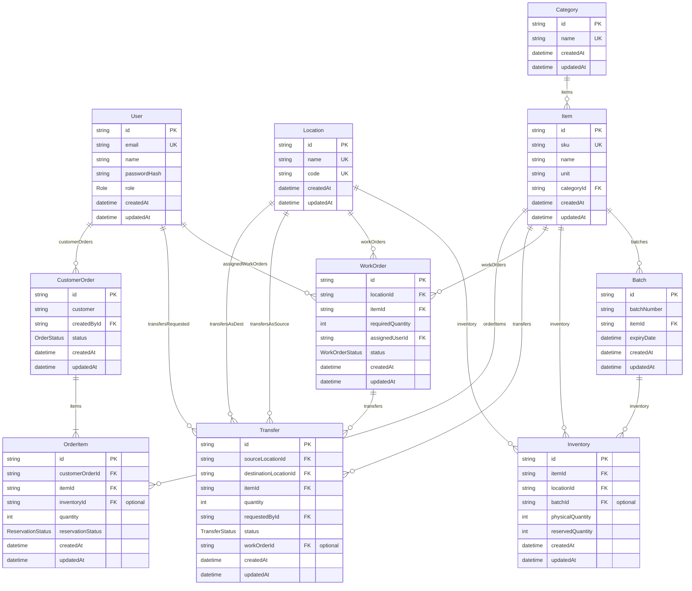

# Fundsroom Mini Operations ERP — Entity-Relationship Diagram (ERD)

This document describes the relational database schema implemented for the Fundsroom Mini Operations ERP, matching the authoritative Prisma schema in [`backend/prisma/schema.prisma`](../backend/prisma/schema.prisma).

---

## 1. Entity-Relationship Diagram

---

## 2. Database Design Notes

- **Datasource & ORM**: PostgreSQL is the configured relational database provider, accessed via Prisma ORM (`backend/prisma/schema.prisma`).
- **Available Quantity Calculation**: `availableQuantity` is never stored as an independent column to prevent synchronization anomalies; it is dynamically calculated as:
  $$\text{availableQuantity} = \text{physicalQuantity} - \text{reservedQuantity}$$
- **Inventory Uniqueness**: `Inventory` enforces a compound unique constraint across `[itemId, locationId, batchId]`, ensuring exactly one inventory ledger record per item, location, and optional batch combination.
- **Item Uniqueness**: `Item.sku` is strictly unique (`@unique`).
- **Location Uniqueness**: Both `Location.name` and `Location.code` are individually unique (`@unique`).
- **Batch Uniqueness**: `Batch` enforces a compound unique constraint across `[itemId, batchNumber]`.
- **Customer Order Line Items**: `CustomerOrder` maintains a 1-to-many relationship with `OrderItem` (`items OrderItem[]`) with `onDelete: Cascade`.
- **Optional Inventory Association**: `OrderItem.inventoryId` is an optional reference (`String?`), populated when specific stock allocation occurs.
- **Dual Location Transfer Relations**: `Transfer` models distinct source and destination relationships pointing to `Location` (`sourceLocationId` via `TransferSource` and `destinationLocationId` via `TransferDestination`).
- **Relational Integrity & Indexes**: Foreign keys are indexed (`@@index`) on all join fields (`categoryId`, `locationId`, `itemId`, `assignedUserId`, `sourceLocationId`, `destinationLocationId`, `requestedById`, `customerOrderId`) to guarantee high-performance queries and referential integrity.
- **Enums**:
  - `Role`: `ADMIN`, `OPERATIONS_USER`, `SALES_USER`
  - `WorkOrderStatus`: `ASSIGNED`, `IN_PROGRESS`, `COMPLETED`
  - `TransferStatus`: `REQUESTED`, `DISPATCHED`, `RECEIVED`
  - `OrderStatus`: `DRAFT`, `PENDING`, `RESERVED`, `CANCELLED`, `COMPLETED`
  - `ReservationStatus`: `PENDING`, `RESERVED`, `RELEASED`
